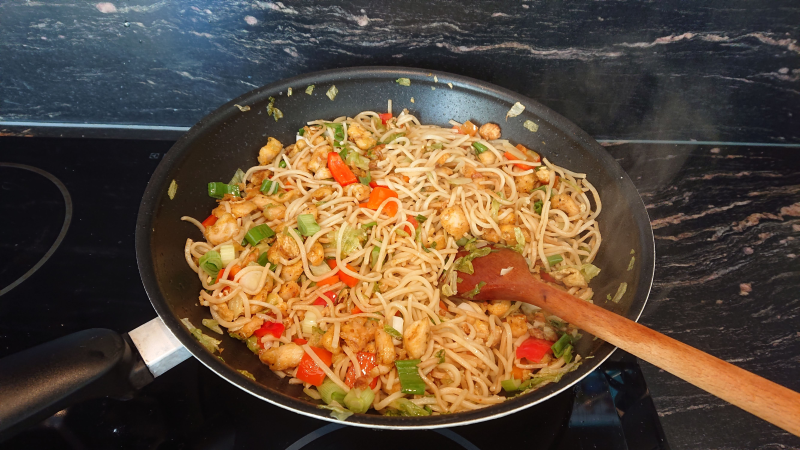

# Čínské smažené nudle

Recept pro 2-3 osoby.

Zdroje

* [YouTube - Starej Fotr](https://www.youtube.com/watch?v=Z3iSVL95--E&feature=youtu.be&ab_channel=StarejFotr)

## Suroviny

* **Čínské nudle**: 250 g
* **Kuřecí prsa**: 100 g
* **Vajíčka**: 3
* **Pekingské zelí**: 6 listů
* **Jarní cibulka**: 1/3 svazku
* **Čersvá paprika**: 1
* **Cibule**: 1 menší
* **Bramborový nebo kukuřičný škrob (solamyl)**: 1 polévková lžíce
* **Česnekový prášek**: 1/2 kávové lžičky
* **Sůl**: 3 kávové lžičky
* **Pepř**: 1/2 kávové lžičky
* **Chilli (Bhut Jolokia)**: 1/2 kávové lžičky
* **Sójová omáčka**: 2 polévkové lžíce
* **Olej**

## Příprava

Nudle

1. V hrnci přivést vodu k varu
2. Přidat kávovou lžičku soli a vypnout
3. Vložit nudle na 8-10 minut a potopit, nedělat je až do měkka
4. Zcedit a neproplachovat studenou vodou

Maso a zelenina

1. Kuřecí prsa nakrájet na nudličky a dát do misky
2. Z jednoho vajíčka oddělit žloutek od bílku a žloutek přidat k masu
3. Zbylá dvě vajíčka rozšlehat s bílkem z prvního
4. Do masa přidat polévkovou lžíci solamilu, půl kávové lžičky soli, chilli a pepř
5. Maso dát během přípravy zeleniny do lednice
6. Nakrouhat pekingské zelí
7. Nakrájet jarní cibulku a papriku

Vaření

1. Rozpálit olej ve Wok pánvi
2. Přidat maso
3. Smažit zhruba 4 minuty a pak maso vyndat
4. Na pánev s tukem od masa dát rozšlehaná vajíčka
5. Přidat špetku soli
6. Dělat chvilku jako omeletu
7. Až bude vajíčko zespodu hotové, rozdělat/roztrhat
8. Vajíčko pořádně opéci, nesmí být vláčné jako míchaná
9. Vajíčko rozmačkat na menší kusy
10. Přidat trochu oleje
11. Přidat nudle a trochu je rozdělat/roztrhat
12. Smažit a promíchávat
13. Přidat zelí, dvě polévkové lžíce sójové omáčky a lžičku soli
14. Smažit a promíchávat
15. Přidat jarní cibulku, papriku a maso
16. Smažit a promíchávat ještě alespoň další 2 minuty

Smažená cibulka

1. Nakrouhat, nekrájet, cibuli
2. Během smažení nudlí vložit cibuli do rozpáleného oleje (musí plavat)
3. Vyndat krátce před tím, než vypadá hotová
4. Prosušit na papírové utěrce

## Tipy

* Nudle lze dělat během, nebo těsně před, smažením
* Nepoužívat celé balení čínských nudlí, 0,5 kg = 8 porcí
* Nudle buď vařit déle, nebo smažit kratší dobu, jinak jsou totiž sušší a tvrdší
* Možno zkusit další zeleninu: hrášek, možná kukuřici
