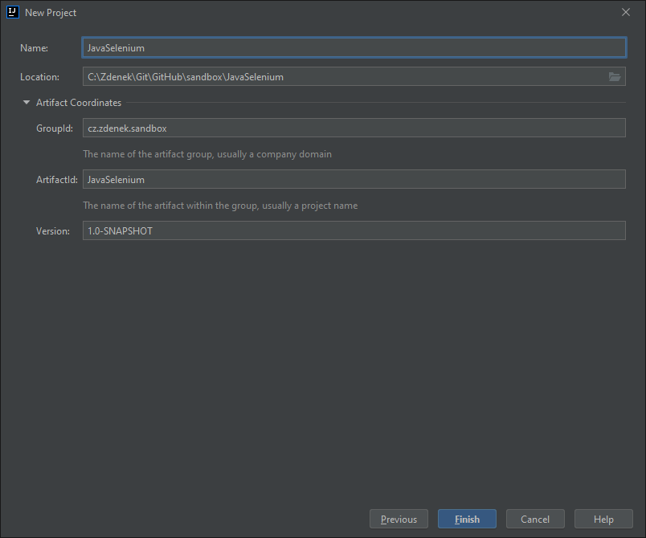

# Selenium

## Installation

Sources

* [Selenium](https://www.selenium.dev/documentation/)
* [ChromeDriver](https://chromedriver.chromium.org/)

Following guide is for Python + Chrome and Java + Chrome.

1. Check your current version of Google Chrome
    1. Open Google Chrome
    2. Go to Help > About Google Chrome
    3. Check your current version, e.g. 97.0.4692.71
2. Download appropriate version of [Chrome Web Driver](https://chromedriver.storage.googleapis.com/index.html),
    choose the version based on your OS and Google Chrome version
3. Decompress the file and save it locally, e.g. to `c:\Program Files\GoogleChromeWebDriver\chromedriver.exe`
4. Add the directory containing `chromedriver.exe` to the `PATH` variable
    1. Windows Start Menu > Edit the system environment variables
    2. Environment Variables > User Variables > Path > Edit > New
    3. Add the path to the directory, e.g. `c:\Program Files\GoogleChromeWebDriver\`

### Setup for Python

In order to use Selenium in Python, the module `selenium` must be installed.

1. Start terminal (Windows Command Prompt or Git Bash)
2. Optionally select virtual environment where you wish to use Selenium
3. Install and/or update `selenium` via PIP

    ```bash
    pip install -U selenium
    ```

4. Test the setup
    1. Create new Python file, e.g. `selenium_demo.py`
    2. Insert the code below

        ```python
        from selenium import webdriver

        web_driver = webdriver.Chrome()
        web_driver.get("https://selenium.dev")
        title = web_driver.title;
        print("The title of the page is", title);
        web_driver.quit()
        ```

    3. Run the program
    4. If everything is setup correctly, the program will open a new instance of
        Chrome, go to [https://selenium.dev](https://selenium.dev), display the
        title of the page on standard output and quit the Chrome

### Setup for Java

In order to use Selenium in Java, the dependency `selenium-java` must be resolved.

1. Start IntelliJ IDEA and create a new project
2. Select Maven, do not choose any archetype and click on Next
3. Set project properties (name, location, group/project IDs)

    

4. Add following dependencies after `properties` section to the configuration file `pom.xml`

    ```xml
    <dependencies>
        <dependency>
            <groupId>org.seleniumhq.selenium</groupId>
            <artifactId>selenium-java</artifactId>
            <version>4.0.0</version>
        </dependency>
    </dependencies>
    ```

5. Create a new class with the code below

    ```java
    import org.openqa.selenium.WebDriver;
    import org.openqa.selenium.chrome.ChromeDriver;

    public class JavaSelenium {
        public static void main(String[] args) {
            WebDriver webDriver = new ChromeDriver();
            webDriver.get("https://selenium.dev");
            String title = webDriver.getTitle();
            System.out.println("The title of the page is " + title);
            webDriver.quit();
        }
    }
    ```

6. Run the program
7. If everything is setup correctly, the program will open a new instance of
    Chrome, go to [https://selenium.dev](https://selenium.dev), display the
    title of the page on standard output and quit the Chrome
